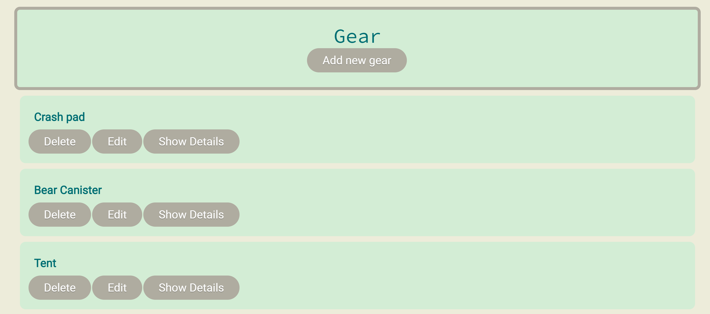
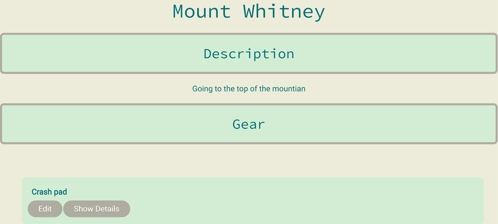

# Gear Closet

## Summary
Simplify planning your next adventure by using Gear Closet. With this app you can store the information 
for all of your gear in one place and easily put together a list of all of the things you want to bring
on your next big trip.

## Screenshots

User's entered gear listed on the homepage

Example of list made by user which includes a selection of their gear

## Live Demo

https://gear-closet.vreplicon.now.sh/

## Backend Repo

https://github.com/vreplicon/gear-closet-api

## Technologies Used

### Front End

React

### Back End

Node.js, Express

### Testing

Chai, Supertest, Mocha
